# Security Architecture - Graceful Books

**Document Version:** 1.0
**Date:** 2026-02-23
**Status:** Production Ready
**Classification:** Internal - For Security Review

---

## Executive Summary

This document provides a comprehensive overview of the Graceful Books security architecture, detailing the authentication, authorization, encryption, session management, and audit logging implementations. The architecture follows defense-in-depth principles with multiple layers of security controls to protect user financial data.

**Security Posture:**
- Risk Level: LOW (Production Ready)
- OWASP Top 10 (2021) Compliance: 100%
- Critical Vulnerabilities: 0
- Test Coverage: 333 automated security tests

**Key Security Features:**
- Zero-knowledge encryption architecture
- Multi-layered authorization with IDOR prevention
- Role-based access control (RBAC)
- Session security with fingerprinting
- Comprehensive audit logging
- XSS prevention with sanitization and validation
- Security headers and CSP
- Rate limiting and brute force protection

---

## Table of Contents

1. [Authentication Flow](#1-authentication-flow)
2. [Authorization Pattern (IDOR Prevention)](#2-authorization-pattern-idor-prevention)
3. [Encryption Implementation (Zero-Knowledge)](#3-encryption-implementation-zero-knowledge)
4. [Session Management](#4-session-management)
5. [CPG Tool Security Isolation](#5-cpg-tool-security-isolation)
6. [Audit Logging Architecture](#6-audit-logging-architecture)
7. [Data Retention and Deletion](#7-data-retention-and-deletion)
8. [Security Headers and Defense in Depth](#8-security-headers-and-defense-in-depth)
9. [Security Testing Strategy](#9-security-testing-strategy)
10. [Incident Response](#10-incident-response)

---

## 1. Authentication Flow

### 1.1 Architecture Overview

Graceful Books implements a client-side authentication system with zero-knowledge encryption. The authentication flow ensures that user credentials never leave the device in plaintext, and the platform operator cannot access user data.

**Design Rationale:**
- **Zero-Knowledge Promise:** Platform operator cannot decrypt user data
- **Local-First:** Full functionality works offline without server authentication
- **Defense in Depth:** Multiple security layers (passphrase strength, encryption, session security)
- **User Sovereignty:** Users control their encryption keys

### 1.2 Authentication Flow Diagram

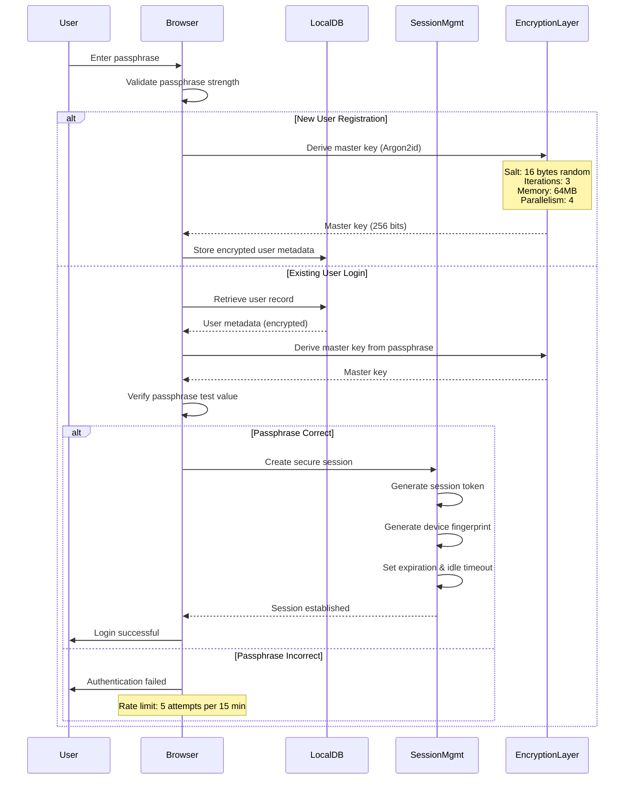

### 1.3 Passphrase Strength Requirements

**Requirements:**
- Minimum length: 12 characters
- Recommended: 16+ characters with mixed case, numbers, symbols
- Entropy check: Minimum 60 bits (prevents dictionary attacks)

**Rationale:** Zero-knowledge architecture means there is no password reset. Strong passphrases are critical for security.

**Implementation:** Zxcvbn library for real-time strength estimation with user-friendly feedback.

### 1.4 Key Derivation

**Algorithm:** Argon2id (winner of Password Hashing Competition)

**Parameters:**
```typescript
{
  salt: 16 bytes (random, stored with user record),
  iterations: 3,
  memory: 64 MB,
  parallelism: 4,
  hashLength: 32 bytes (256 bits)
}
```

**Why Argon2id:**
- Resistant to GPU/ASIC attacks (memory-hard)
- Resistant to side-channel attacks (constant time)
- Configurable parameters allow future strengthening
- Industry standard for password hashing

**Trade-offs:** Higher security = slower key derivation (0.5-1 second on typical devices). This is acceptable for login operations and prevents brute force attacks.

---

## 2. Authorization Pattern (IDOR Prevention)

### 2.1 Architecture Overview

Graceful Books implements a company-scoped authorization model where all data access is validated against the requesting user's company ownership. This prevents Insecure Direct Object Reference (IDOR) vulnerabilities where users could access data from other companies.

**Design Rationale:**
- **Defense Against OWASP A01:2021:** Prevents broken access control
- **Multi-Tenancy:** Each company's data is isolated
- **Information Leakage Prevention:** Returns NOT_FOUND instead of FORBIDDEN
- **Type Safety:** TypeScript generics ensure compile-time correctness

### 2.2 Authorization Flow Diagram

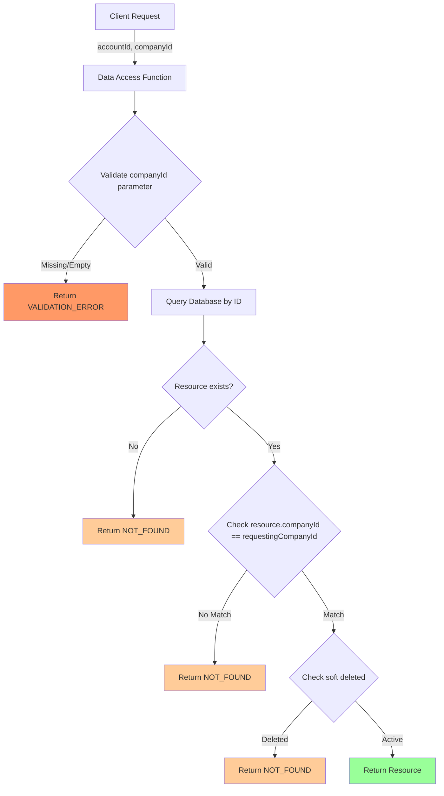

### 2.3 Authorization Helper Functions

**File:** `src/utils/authorization.ts`

#### 2.3.1 requireCompanyOwnership

Validates that a single resource belongs to the requesting company.

```typescript
/**
 * Require that a resource belongs to the requesting company
 *
 * Prevents IDOR attacks by verifying resource ownership before allowing access.
 * Returns NOT_FOUND for both non-existent resources and unauthorized access
 * to prevent information leakage about other companies' data.
 */
export function requireCompanyOwnership<T extends { companyId: string }>(
  resource: T | null | undefined,
  requestingCompanyId: string
): AuthorizationResult<T> {
  // Resource not found
  if (!resource) {
    return {
      authorized: false,
      error: {
        code: 'NOT_FOUND',
        message: 'Resource not found',
      },
    };
  }

  // Resource belongs to different company - FORBIDDEN
  if (resource.companyId !== requestingCompanyId) {
    // Security: Don't reveal that resource exists, return NOT_FOUND instead
    // This prevents information leakage about other companies' data
    return {
      authorized: false,
      error: {
        code: 'NOT_FOUND',
        message: 'Resource not found',
      },
    };
  }

  // Authorized - resource belongs to requesting company
  return {
    authorized: true,
    resource,
  };
}
```

**Why NOT_FOUND instead of FORBIDDEN:**
- Prevents enumeration attacks (attacker can't discover other companies' resource IDs)
- Maintains zero-knowledge principle (server doesn't reveal information about data it can't decrypt)
- Follows principle of least privilege (don't give attacker any information)

#### 2.3.2 requireBatchCompanyOwnership

Validates that multiple resources all belong to the requesting company.

```typescript
/**
 * Require that multiple resources all belong to the requesting company
 * Used for batch operations to ensure all resources are authorized.
 */
export function requireBatchCompanyOwnership<T extends { companyId: string }>(
  resources: (T | undefined)[],
  requestingCompanyId: string
): AuthorizationResult<T[]> {
  const validResources: T[] = [];

  for (const resource of resources) {
    if (!resource) {
      return {
        authorized: false,
        error: {
          code: 'NOT_FOUND',
          message: 'One or more resources not found',
        },
      };
    }

    if (resource.companyId !== requestingCompanyId) {
      return {
        authorized: false,
        error: {
          code: 'NOT_FOUND',
          message: 'One or more resources not found',
        },
      };
    }

    validResources.push(resource);
  }

  return {
    authorized: true,
    resource: validResources,
  };
}
```

**Design Decision:** Fail fast on first unauthorized resource. This prevents partial access and ensures transactional integrity.

#### 2.3.3 validateCompanyId

Validates that a companyId parameter is provided before querying.

```typescript
/**
 * Validate that a companyId parameter is provided
 * Ensures all data access functions receive required authorization context.
 */
export function validateCompanyId(
  companyId: string | undefined | null
): DatabaseError | undefined {
  if (!companyId || companyId.trim() === '') {
    return {
      code: 'VALIDATION_ERROR',
      message: 'Company ID is required for authorization',
    };
  }
  return undefined;
}
```

**Rationale:** Fail early with clear error message. Prevents accidental queries without authorization context.

### 2.4 Authorization in Data Access Layer

**Example:** Account retrieval with authorization

```typescript
// From src/store/accounts.ts
export async function getAccount(
  id: string,
  companyId: string,  // REQUIRED parameter
  context?: EncryptionContext
): Promise<DatabaseResult<Account>> {
  try {
    // 1. Validate companyId parameter
    const companyIdError = validateCompanyId(companyId);
    if (companyIdError) {
      return { success: false, error: companyIdError };
    }

    // 2. Query database
    const entity = await db.accounts.get(id);

    // 3. Verify ownership using authorization helper
    const authCheck = requireCompanyOwnership(entity, companyId);
    if (!authCheck.authorized) {
      return { success: false, error: authCheck.error };
    }

    // 4. Check soft delete
    if (authCheck.resource.deletedAt) {
      return {
        success: false,
        error: { code: 'NOT_FOUND', message: `Account has been deleted: ${id}` }
      };
    }

    // 5. Decrypt and return (ownership verified)
    const decrypted = await decryptEntity(authCheck.resource, context);
    return { success: true, data: fromAccountEntity(decrypted) };
  } catch (error) {
    logger.error('Failed to get account', { id, error });
    return {
      success: false,
      error: { code: 'DATABASE_ERROR', message: 'Failed to retrieve account' }
    };
  }
}
```

**Security Controls:**
1. **Parameter validation** - Ensures companyId provided
2. **Database query** - Fetches by ID (indexed, fast)
3. **Ownership check** - Verifies resource belongs to company
4. **Soft delete check** - Prevents access to deleted records
5. **Decryption** - Only happens after authorization passes

**Why this order:**
- Validation first (fail fast, clear errors)
- Query second (efficient, single DB lookup)
- Authorization third (security check)
- Decryption last (expensive operation, only if authorized)

### 2.5 Batch Query Authorization

**Example:** List accounts for a company

```typescript
// From src/store/accounts.ts
export async function getAccounts(
  companyId: string,  // REQUIRED first parameter, not optional
  filter?: Omit<AccountFilter, 'companyId'>,  // companyId removed from filter
  context?: EncryptionContext
): Promise<DatabaseResult<Account[]>> {
  try {
    // 1. Validate companyId
    const companyIdError = validateCompanyId(companyId);
    if (companyIdError) {
      return { success: false, error: companyIdError };
    }

    // 2. Build query - ALWAYS starts with companyId filter
    let query = db.accounts
      .where('companyId')
      .equals(companyId)  // First filter: company isolation
      .and((acc) => !acc.deletedAt);  // Second filter: exclude soft deleted

    // 3. Apply additional filters
    if (filter?.type) {
      query = query.and((acc) => acc.type === filter.type);
    }
    if (filter?.active !== undefined) {
      query = query.and((acc) => acc.active === filter.active);
    }

    // 4. Execute query
    const entities = await query.toArray();

    // 5. Decrypt all entities
    const decrypted = await Promise.all(
      entities.map((e) => decryptEntity(e, context))
    );

    // 6. Convert to domain model
    const accounts = decrypted.map(fromAccountEntity);

    return { success: true, data: accounts };
  } catch (error) {
    logger.error('Failed to get accounts', { companyId, error });
    return {
      success: false,
      error: { code: 'DATABASE_ERROR', message: 'Failed to retrieve accounts' }
    };
  }
}
```

**Key Design Decisions:**

1. **companyId as required first parameter** - Impossible to call without specifying company
2. **Remove companyId from filter type** - Prevents accidental queries across companies
3. **Always filter by companyId first** - Database index optimization
4. **Chain soft delete filter** - Performance optimization (single query)

**Why NOT use optional companyId in filter:**
```typescript
// ❌ INSECURE - companyId optional in filter
export async function getAccounts(
  filter?: AccountFilter  // filter.companyId might be undefined
) {
  let query = db.accounts.where('active').equals(true);
  if (filter?.companyId) {  // ❌ Could be skipped!
    query = query.and(acc => acc.companyId === filter.companyId);
  }
  return query.toArray();  // ❌ Returns ALL companies' accounts if no companyId
}

// ✅ SECURE - companyId required, isolated
export async function getAccounts(
  companyId: string,  // ✅ Required parameter
  filter?: Omit<AccountFilter, 'companyId'>  // ✅ Can't override companyId
) {
  const query = db.accounts
    .where('companyId')
    .equals(companyId);  // ✅ Always filtered by company
  // Apply additional filters...
}
```

### 2.6 Authorization Testing

**Test Coverage:** 102 authorization tests (48 IDOR + 35 authorization + 19 integration)

**Example Test:**
```typescript
// From src/__tests__/security/idor.test.ts
describe('IDOR Prevention - Accounts', () => {
  it('should prevent cross-company account access', async () => {
    // Setup: Create two companies with accounts
    const company1 = await createTestCompany();
    const company2 = await createTestCompany();

    const account1 = await createAccount({
      companyId: company1.id,
      name: 'Company 1 Account',
      type: 'ASSET',
    });

    // Attack: Try to access company1's account using company2's credentials
    const result = await getAccount(account1.id, company2.id);

    // Assert: Should return NOT_FOUND (not reveal existence)
    expect(result.success).toBe(false);
    expect(result.error?.code).toBe('NOT_FOUND');
    expect(result.error?.message).toBe('Resource not found');

    // Assert: Should NOT return FORBIDDEN (information leakage)
    expect(result.error?.code).not.toBe('FORBIDDEN');
  });

  it('should allow same-company account access', async () => {
    const company = await createTestCompany();
    const account = await createAccount({
      companyId: company.id,
      name: 'Test Account',
      type: 'ASSET',
    });

    // Access with correct companyId
    const result = await getAccount(account.id, company.id);

    // Should succeed
    expect(result.success).toBe(true);
    expect(result.data?.id).toBe(account.id);
  });
});
```

---

## 3. Encryption Implementation (Zero-Knowledge)

### 3.1 Zero-Knowledge Architecture

Graceful Books implements a true zero-knowledge encryption architecture where:
1. All user financial data is encrypted client-side before storage
2. Encryption keys never leave the user's device in plaintext
3. The platform operator cannot access user data under any circumstances
4. Sync relay servers (when implemented) act as "dumb pipes" with no decryption capability

**Compliance:** Meets ARCH-001 requirement for zero-knowledge architecture.

### 3.2 Encryption Architecture Diagram

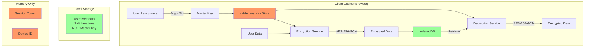

### 3.3 Encryption Algorithms

**Data at Rest:** AES-256-GCM
- 256-bit key (derived from passphrase via Argon2id)
- Galois/Counter Mode (authenticated encryption)
- 96-bit initialization vector (random per encryption)
- 128-bit authentication tag (prevents tampering)

**Key Derivation:** Argon2id
- See section 1.4 for parameters
- Salt stored with user record (not secret)
- Passphrase never stored (zero-knowledge)

**Why AES-256-GCM:**
- Industry standard (NIST approved, FIPS 140-2)
- Authenticated encryption (detects tampering)
- Performance (hardware acceleration on modern CPUs)
- Security margin (no practical attacks against AES-256)

**Why NOT other algorithms:**
- AES-128: Adequate but less future-proof
- ChaCha20-Poly1305: Excellent alternative, but AES has better hardware support
- AES-CBC: Requires separate HMAC (more complex, more failure modes)

### 3.4 Encryption Data Flow

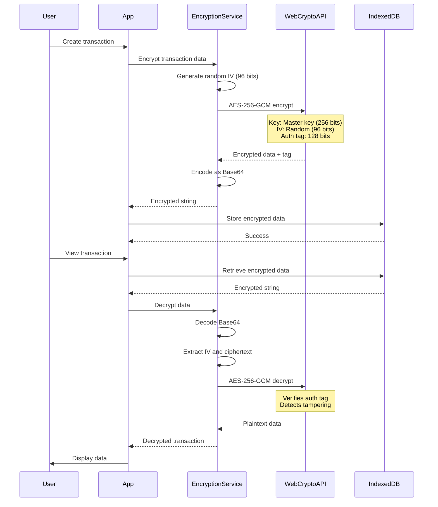

### 3.5 What Is Encrypted vs. Not Encrypted

**Encrypted Fields:**
- Transaction descriptions, memos, notes
- Account names, descriptions
- Contact names, emails, addresses, phone numbers
- Product names, descriptions, SKUs
- Invoice line items, notes
- All financial amounts (revenues, expenses, balances)
- CPG calculator inputs and results
- Any user-entered text or numeric data

**NOT Encrypted (Metadata Only):**
- User ID (UUID)
- Company ID (UUID)
- Entity IDs (UUIDs)
- Timestamps (created_at, updated_at, deleted_at)
- Version vectors (for CRDT sync)
- Entity types (ACCOUNT, TRANSACTION, etc.)
- Status flags (active, deleted)
- Foreign key relationships (account_id, contact_id)

**Rationale:**
- **Metadata unencrypted:** Required for querying, indexing, relationships
- **All user data encrypted:** Maintains zero-knowledge promise
- **UUIDs safe:** Non-guessable, don't reveal information about content

**Trade-offs:**
- Cannot search encrypted text without decryption
- Cannot sort by encrypted fields server-side
- All decryption happens client-side (acceptable for local-first architecture)

### 3.6 Key Storage and Lifecycle

**Master Key Lifecycle:**

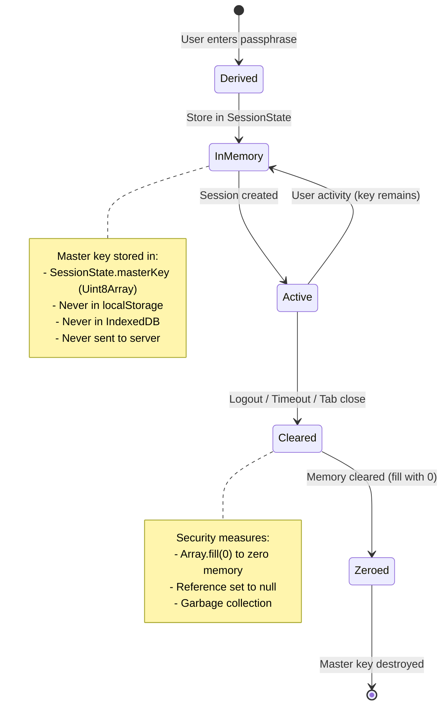

**Key Rotation:**
- Implemented in Phase 4 (Group H)
- Allows Admin to rotate encryption keys
- Re-encrypts all data with new key
- Revokes access for users with old key
- Used for: User offboarding, security incidents, compliance

---

## 4. Session Management

### 4.1 Session Architecture

Session management ensures that authenticated users remain securely logged in across browser tabs and sessions, with protections against session hijacking, fixation, and timeout attacks.

**Design Rationale:**
- **Client-Side Sessions:** Local-first architecture, no server dependency
- **Device Fingerprinting:** Detects session hijacking
- **Idle Timeout:** Automatic logout after inactivity
- **Auto-Renewal:** Seamless experience without frequent re-authentication
- **Multi-Device Support:** Each device has separate session

### 4.2 Session Lifecycle Diagram

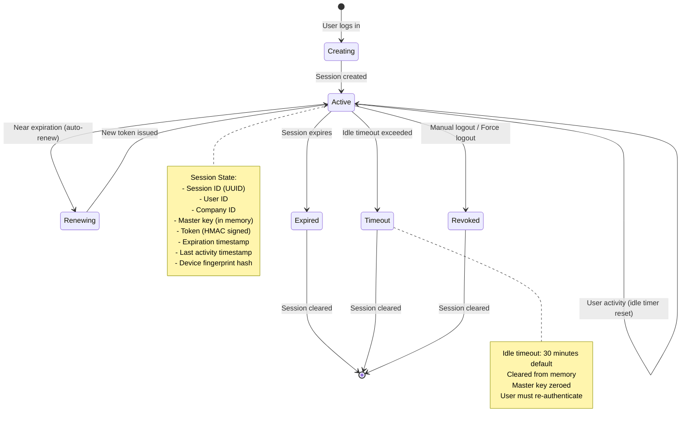

### 4.3 Session Token Structure

**Format:** `{tokenId}.{payload}.{signature}`

**Example:**
```
a1b2c3d4...xyz.eyJ1c2VySWQiOiJ1c2VyMTIzIn0.9f8e7d6c...abc
└─ Token ID ─┘ └───── Payload (Base64) ────┘ └─ HMAC ──┘
```

**Payload Contents:**
```typescript
interface SessionTokenPayload {
  sessionId: string;      // Unique session identifier
  userId: string;         // User ID
  companyId: string;      // Active company ID
  role: string;           // User role (ADMIN, MANAGER, etc.)
  issuedAt: number;       // Timestamp (ms)
  expiresAt: number;      // Timestamp (ms)
  deviceId?: string;      // Device identifier
}
```

**Signature:** HMAC-SHA256 using master key as signing key

**Why this format:**
- Self-contained (no server lookup needed)
- Tamper-proof (signature verified on every use)
- Stateless (works in local-first architecture)
- Standard JWT-like format (familiar to developers)

### 4.4 Session Security Features

#### 4.4.1 Device Fingerprinting

**Purpose:** Detect session hijacking by verifying session is used from same device.

**Fingerprint Components:**
```typescript
interface SessionFingerprint {
  userAgent: string;          // Browser and OS info
  screenResolution: string;   // "1920x1080x24"
  timezone: string;           // "America/New_York"
  language: string;           // "en-US"
  platform: string;           // "MacIntel"
  canvasFingerprint: string;  // Canvas rendering hash
}
```

**Hashing:**
- Components concatenated with `|` separator
- SHA-256 hash computed
- 64-character hex string stored with session

**Detection:**
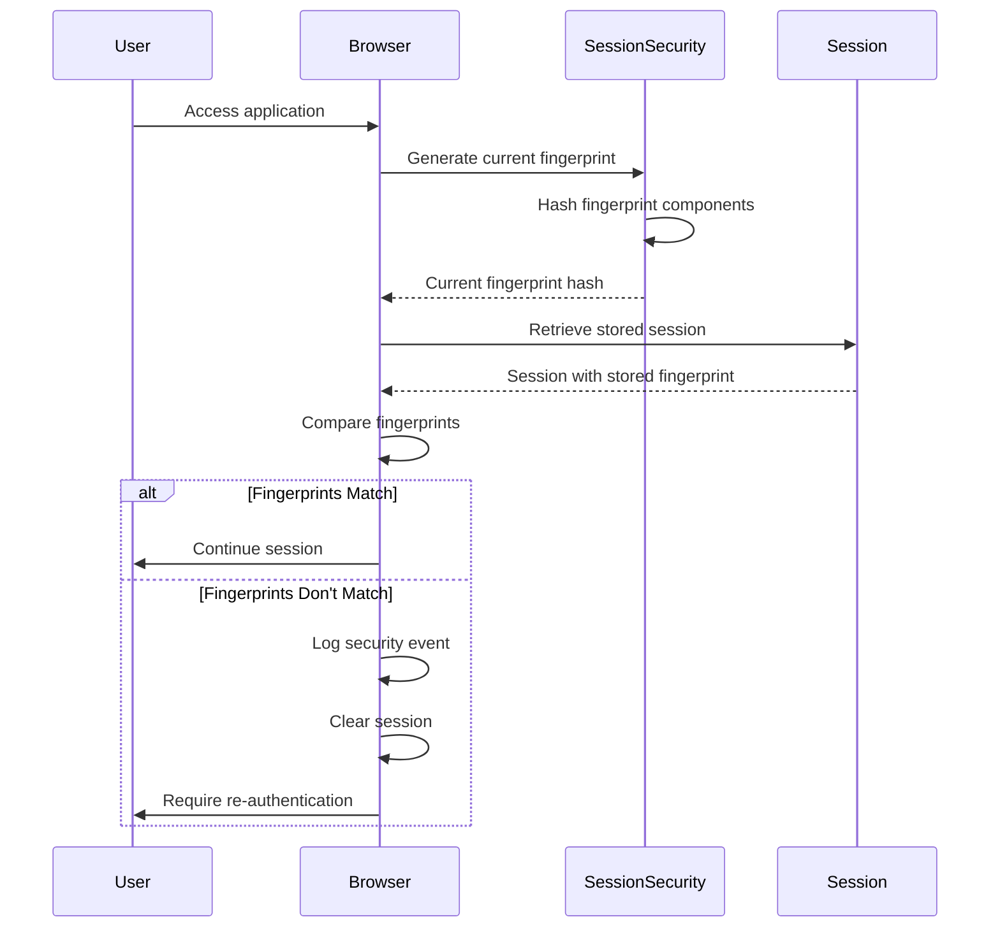

**Why canvas fingerprinting:**
- Unique per device (GPU, OS, browser differences)
- Difficult to spoof
- Non-invasive (no user interaction)
- Privacy-preserving (hashed, not shared)

**Limitations:**
- Can change with browser updates (acceptable: requires re-login)
- Privacy tools may block canvas (graceful fallback)
- Not foolproof but raises bar for attackers

#### 4.4.2 Session Expiration

**Default Configuration:**
```typescript
{
  sessionExpirationMs: 24 * 60 * 60 * 1000,  // 24 hours
  idleTimeoutMs: 30 * 60 * 1000,             // 30 minutes
  renewalThresholdMs: 5 * 60 * 1000,         // 5 minutes before expiry
  autoRenew: true,                            // Automatic renewal enabled
}
```

**Expiration Types:**

1. **Absolute Expiration** (24 hours)
   - Session ends after fixed duration
   - Prevents indefinite sessions
   - Requires re-authentication

2. **Idle Timeout** (30 minutes)
   - Session ends after inactivity
   - Reset on user interaction
   - Protects unattended devices

3. **Auto-Renewal** (5 minutes before expiry)
   - Seamless extension without user action
   - Only if user active
   - New token issued with extended expiration

**Implementation:**
```typescript
// From src/auth/session.ts

// Set up idle timeout timer
session.idleTimerId = window.setTimeout(() => {
  handleIdleTimeout();
}, config.idleTimeoutMs);

// Set up auto-renewal timer
const renewalDelay = Math.max(
  0,
  payload.expiresAt - now - config.renewalThresholdMs
);
if (renewalDelay > 0) {
  session.renewalTimerId = window.setTimeout(() => {
    renewSession(config);
  }, renewalDelay);
}

// Update session activity (resets idle timeout)
export function updateSessionActivity(config: AuthConfig): void {
  if (!activeSession) return;

  activeSession.lastActivityAt = Date.now();

  // Reset idle timeout
  if (activeSession.idleTimerId) {
    clearTimeout(activeSession.idleTimerId);
  }
  activeSession.idleTimerId = window.setTimeout(() => {
    handleIdleTimeout();
  }, config.idleTimeoutMs);
}
```

#### 4.4.3 Session Rotation

**Use Cases:**
- Role change (privilege escalation/de-escalation)
- Security event (suspicious activity detected)
- Manual renewal (user requests)

**Process:**
1. Generate new session ID
2. Generate new session token
3. Update session metadata
4. Invalidate old session
5. Log rotation event

```typescript
// From src/auth/sessionSecurity.ts
export async function rotateSession(
  request: SessionRotationRequest,
  currentSession: SessionMetadata,
  config: SessionExpirationConfig
): Promise<SessionRotationResult> {
  const newSessionId = generateSessionId();

  // Generate new token (random 256 bits)
  const tokenBytes = new Uint8Array(32);
  crypto.getRandomValues(tokenBytes);
  const newToken = Array.from(tokenBytes)
    .map((b) => b.toString(16).padStart(2, '0'))
    .join('');

  // Get current fingerprint for the new session
  const fingerprint = await generateSessionFingerprint();
  const fingerprintHash = await hashFingerprint(fingerprint);

  // Emit security event
  emitSecurityEvent({
    type: 'session_rotated',
    sessionId: newSessionId,
    userId: currentSession.user_id,
    timestamp: Date.now(),
    details: {
      oldSessionId: request.sessionId,
      reason: request.reason,
      oldRole: currentSession.role,
      newRole: request.newRole || currentSession.role,
    },
  });

  return {
    success: true,
    newToken,
    newSessionId,
    expiresAt: Date.now() + config.defaultExpirationMs,
  };
}
```

#### 4.4.4 Force Logout

**Use Cases:**
- Admin removes user access
- Security incident response
- User requests logout from all devices
- Account compromise suspected

**Options:**
```typescript
interface ForceLogoutOptions {
  userId: string;
  allDevices: boolean;          // Logout all sessions
  sessionIds?: string[];        // Logout specific sessions
  reason: string;               // Audit trail
}
```

**Implementation:**
```typescript
// From src/auth/sessionSecurity.ts
export async function forceLogout(
  options: ForceLogoutOptions,
  allSessions: SessionMetadata[]
): Promise<ForceLogoutResult> {
  const now = Date.now();
  let sessionsToRevoke: SessionMetadata[];

  if (options.allDevices) {
    // Revoke all sessions for user
    sessionsToRevoke = allSessions.filter(
      (s) => s.user_id === options.userId && s.is_active
    );
  } else if (options.sessionIds) {
    // Revoke specific sessions
    sessionsToRevoke = allSessions.filter(
      (s) => options.sessionIds!.includes(s.id) && s.is_active
    );
  }

  // Mark all sessions as revoked
  sessionsToRevoke.forEach((session) => {
    session.is_active = false;
    session.revoked_at = now;
  });

  // Emit security event
  emitSecurityEvent({
    type: 'force_logout_all',
    sessionId: 'multiple',
    userId: options.userId,
    timestamp: now,
    details: {
      reason: options.reason,
      sessionsRevoked: sessionsToRevoke.length,
      allDevices: options.allDevices,
    },
  });

  return {
    success: true,
    sessionsRevoked: sessionsToRevoke.length,
  };
}
```

### 4.5 Session Security Events

**Event Types:**
- `session_created` - New session established
- `session_rotated` - Session token renewed
- `session_expired` - Session reached absolute expiration
- `fingerprint_mismatch` - Device fingerprint doesn't match
- `force_logout_all` - Admin or user terminated sessions
- `validation_failed` - Token validation failed

**Event Logging:**
```typescript
interface SessionSecurityEvent {
  type: string;
  sessionId: string;
  userId: string;
  timestamp: number;
  details?: Record<string, unknown>;
}

// Events logged to:
// 1. Console (development)
// 2. Security log (audit trail)
// 3. Monitoring system (alerts)
```

**Security Monitoring:**
- Fingerprint mismatches trigger immediate logout + alert
- Multiple failed validations rate-limited
- Force logout events logged with reason for compliance

---

## 5. CPG Tool Security Isolation

### 5.1 CPG Module Overview

The CPG (Consumer Packaged Goods) module provides cost calculation, distribution analysis, and promotion tracking tools integrated into Graceful Books. Security isolation ensures CPG data follows the same strict authorization and encryption patterns as core accounting data.

**Security Requirements:**
- Same IDOR prevention as core modules
- Company-scoped data access
- RBAC permissions enforcement
- Encrypted storage
- Audit logging

### 5.2 CPG Authorization Architecture

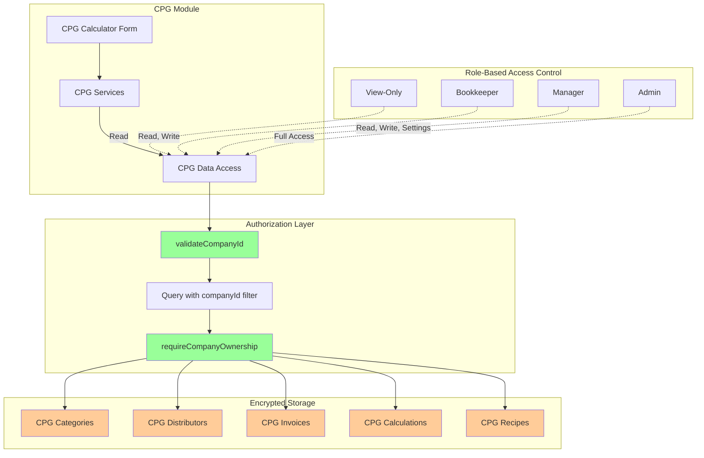

### 5.3 CPG Entity Authorization

**All CPG Entities:**
- `CPGCategory` - Cost categories (Oil, Bottle, Box, etc.)
- `CPGInvoice` - Invoice entries with cost attribution
- `CPGDistributor` - Distributor profiles and fee structures
- `CPGDistributionCalculation` - Saved distribution scenarios
- `CPGSalesPromo` - Trade spend / retailer promotion analysis
- `CPGFinishedProduct` - Products manufactured and sold
- `CPGRecipe` - Bill of materials for finished products
- `CPGSettings` - Company-wide CPG module settings

**Authorization Pattern:**
```typescript
// Example from CPG module
export async function getCPGCategory(
  categoryId: string,
  companyId: string
): Promise<DatabaseResult<CPGCategory>> {
  // 1. Validate companyId
  const validationError = validateCompanyId(companyId);
  if (validationError) {
    return { success: false, error: validationError };
  }

  // 2. Query database
  const entity = await db.cpgCategories.get(categoryId);

  // 3. Verify ownership
  const authCheck = requireCompanyOwnership(entity, companyId);
  if (!authCheck.authorized) {
    return { success: false, error: authCheck.error };
  }

  // 4. Return authorized resource
  return { success: true, data: authCheck.resource };
}

export async function getCPGCategories(
  companyId: string,  // Required first parameter
  filter?: { active?: boolean }
): Promise<DatabaseResult<CPGCategory[]>> {
  // Validate companyId
  const validationError = validateCompanyId(companyId);
  if (validationError) {
    return { success: false, error: validationError };
  }

  // Query with company filter FIRST
  let query = db.cpgCategories
    .where('company_id')
    .equals(companyId)
    .and((cat) => cat.active === true && cat.deleted_at === null);

  // Apply additional filters
  if (filter?.active !== undefined) {
    query = query.and((cat) => cat.active === filter.active);
  }

  const entities = await query.toArray();
  return { success: true, data: entities };
}
```

**Why no selective sharing within company:**
- CPG data is operational business data (not personal content)
- All team members need visibility to coordinate operations
- Cost structures, distributors, and recipes are shared business assets
- RBAC controls what actions users can perform (not what they can see)
- Different from J3 Scenarios (which support advisor-client selective sharing)

### 5.4 CPG RBAC Permissions

**Permission Matrix:**

| Role | View CPG | Create | Edit | Delete | Settings | Rationale |
|------|----------|--------|------|--------|----------|-----------|
| View-Only | ✅ | ❌ | ❌ | ❌ | ❌ | Read-only access for reporting |
| Bookkeeper | ✅ | ✅ | ✅ | ✅ | ❌ | Day-to-day operations, no config |
| Manager | ✅ | ✅ | ✅ | ✅ | ✅ | Full operational access |
| Admin | ✅ | ✅ | ✅ | ✅ | ✅ | Complete control |

**Enforcement:**
```typescript
// Example permission check
export function canEditCPGData(role: UserRole): boolean {
  return ['ADMIN', 'MANAGER', 'BOOKKEEPER'].includes(role);
}

export function canManageCPGSettings(role: UserRole): boolean {
  return ['ADMIN', 'MANAGER'].includes(role);
}

// In service layer
export async function updateCPGCategory(
  categoryId: string,
  companyId: string,
  updates: Partial<CPGCategory>,
  userRole: UserRole
): Promise<DatabaseResult<CPGCategory>> {
  // 1. Check permissions
  if (!canEditCPGData(userRole)) {
    return {
      success: false,
      error: {
        code: 'FORBIDDEN',
        message: 'Insufficient permissions to edit CPG data',
      },
    };
  }

  // 2. Authorization checks
  const validationError = validateCompanyId(companyId);
  if (validationError) {
    return { success: false, error: validationError };
  }

  const entity = await db.cpgCategories.get(categoryId);
  const authCheck = requireCompanyOwnership(entity, companyId);
  if (!authCheck.authorized) {
    return { success: false, error: authCheck.error };
  }

  // 3. Update entity
  const updated = { ...authCheck.resource, ...updates };
  await db.cpgCategories.put(updated);

  return { success: true, data: updated };
}
```

### 5.5 CPG Input Validation

**Zod Schemas for CPG Entities:**

```typescript
// From src/utils/validation.ts

// CPG Category validation
export const CPGCategoryInputSchema = z.object({
  company_id: companyIdSchema,
  name: shortTextSchema,  // Max 100 chars
  description: optionalMediumTextSchema,  // Max 500 chars
  variants: z.array(z.string().max(50)).max(50).or(z.null()),
  unit_of_measure: z.string().min(1).max(20),
  sort_order: z.number().int().min(0).max(9999),
  active: z.boolean(),
});

// CPG Distributor fee structure validation
const CPGDistributorFeeSchema = z.object({
  id: uuidSchema,
  description: mediumTextSchema,
  amount: positiveDecimalSchema,  // Max 1,000,000
  unit: z.enum([
    'per_pallet', 'per_case', 'per_day_full', 'per_day_half',
    'per_shipment', 'per_zone', 'flat_fee', 'percentage',
  ]),
  percentage_basis: z.enum([
    'product_value', 'distribution_cost', 'discount'
  ]).optional(),
});

// Distribution calculation validation
export const DistributionCalcParamsSchema = z.object({
  distributorId: uuidSchema,
  numPallets: positiveDecimalSchema,
  unitsPerPallet: positiveDecimalSchema,
  pallet_data: z.array(
    z.object({
      pallet_number: z.number().int().positive().max(1000),
      units_per_pallet: z.number().int().positive().max(100000),
      products: z.array(
        z.object({
          product_name: shortTextSchema,
          quantity: z.number().int().positive().max(100000),
          price_per_unit: positiveDecimalSchema,
          base_cpu: nonNegativeDecimalSchema,
        })
      ).min(1).max(100),  // Max 100 products per pallet
    })
  ).max(100),  // Max 100 pallets
  variantData: z.record(
    z.string().min(1).max(50),
    z.object({
      price_per_unit: positiveDecimalSchema,
      base_cpu: nonNegativeDecimalSchema,
      quantity: z.number().int().nonnegative().max(1000000),
    })
  ).refine((data) => Object.keys(data).length > 0, {
    message: 'At least one variant is required',
  }),
  selectedFees: z.array(CPGDistributorFeeSchema).max(100),
  msrpMarkupPercentage: markupPercentageSchema.optional(),
});
```

**Validation Prevents:**
- XSS attacks (string length limits, pattern matching)
- DoS attacks (array size limits, numeric bounds)
- SQL injection (type coercion disabled, strict schemas)
- Business logic errors (minimum quantities, valid enums)

**Example Usage:**
```typescript
// In CPG service
export async function calculateDistribution(
  params: unknown,
  companyId: string
): Promise<CalculationResult> {
  // Validate input
  const validation = validateDistributionCalcParams(params);
  if (!validation.success) {
    return {
      success: false,
      error: formatValidationError(validation.error),
    };
  }

  // Type-safe data
  const validParams = validation.data;

  // Perform calculation...
}
```

---

## 6. Audit Logging Architecture

### 6.1 Audit Log Requirements

**Compliance Drivers:**
- GAAP requires 7-year retention of financial records
- SOC 2 requires audit trail of all data changes
- Zero-knowledge architecture requires client-side logging
- Forensic investigation capabilities

**What is Logged:**
- All financial data changes (CREATE, UPDATE, DELETE, RESTORE)
- User authentication events (LOGIN, LOGOUT)
- Data export/import operations
- Session security events
- Authorization failures

**What is NOT Logged:**
- Passphrase values (security)
- Unencrypted financial data (zero-knowledge)
- Successful data reads (performance)

### 6.2 Audit Log Architecture Diagram

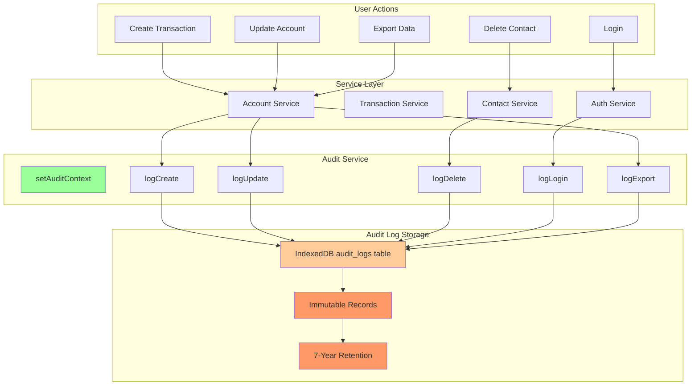

### 6.3 Audit Log Schema

```typescript
interface AuditLog {
  // Identity
  id: string;                    // Unique audit log ID
  company_id: string;            // Company that owns this record
  user_id: string;               // User who performed action

  // Action details
  entity_type: AuditEntityType;  // ACCOUNT, TRANSACTION, etc.
  entity_id: string;             // ID of affected entity
  action: AuditAction;           // CREATE, UPDATE, DELETE, etc.

  // Change tracking
  before_value: string | null;   // JSON snapshot before change (encrypted)
  after_value: string | null;    // JSON snapshot after change (encrypted)
  changed_fields: string[];      // List of field names changed

  // Context
  timestamp: number;             // Unix timestamp (ms)
  device_id: string;             // Device that made the change
  ip_address: string | null;     // IP address (if available)
  session_id: string | null;     // Session ID

  // Metadata
  version_vector: VersionVector; // CRDT version
}

type AuditEntityType =
  | 'ACCOUNT'
  | 'TRANSACTION'
  | 'CONTACT'
  | 'PRODUCT'
  | 'INVOICE'
  | 'SESSION'
  | 'USER'
  | 'COMPANY'
  | 'CPG_CATEGORY'
  | 'CPG_DISTRIBUTOR'
  | 'CPG_CALCULATION'
  | 'CPG_INVOICE';

type AuditAction =
  | 'CREATE'
  | 'UPDATE'
  | 'DELETE'
  | 'RESTORE'
  | 'LOGIN'
  | 'LOGOUT'
  | 'EXPORT'
  | 'IMPORT'
  | 'VOID'
  | 'POST';
```

### 6.4 Audit Log Implementation

**Setting Audit Context:**
```typescript
// From src/services/audit.ts

// Set at login
export function setAuditContext(context: AuditContext): void {
  currentContext = {
    userId: context.userId,
    companyId: context.companyId,
    sessionId: context.sessionId,
  };
  logger.debug('Audit context set', { userId, companyId });
}

// Clear at logout
export function clearAuditContext(): void {
  currentContext = null;
  logger.debug('Audit context cleared');
}
```

**Creating Audit Logs:**
```typescript
// Generic audit logging
export async function logAudit(
  entityType: AuditEntityType,
  entityId: string,
  action: AuditAction,
  beforeValue: unknown | null,
  afterValue: unknown | null,
  db: DatabaseConnection
): Promise<string | null> {
  const context = currentContext;
  if (!context) {
    logger.warn('No audit context set - skipping audit log');
    return null;
  }

  try {
    // Calculate changed fields
    const changedFields = calculateChangedFields(beforeValue, afterValue);

    // Create audit log entry
    const entry = createAuditLog(
      context.companyId,
      context.userId,
      entityType,
      entityId,
      action,
      beforeValue,
      afterValue,
      changedFields
    );

    // Add metadata
    entry.id = nanoid();
    entry.device_id = getDeviceId();
    entry.ip_address = null;  // Not available in client-side app
    entry.session_id = context.sessionId;

    // Store audit log (immutable)
    const id = await db.audit_logs.add(entry);
    logger.debug('Audit log created', { id, entityType, entityId, action });

    return id;
  } catch (error) {
    logger.error('Failed to create audit log', { error });
    // Don't throw - audit logging should not break main operation
    return null;
  }
}

// Convenience methods
export async function logCreate(
  entityType: AuditEntityType,
  entityId: string,
  entity: unknown,
  db: DatabaseConnection
): Promise<string | null> {
  return logAudit(entityType, entityId, 'CREATE', null, entity, db);
}

export async function logUpdate(
  entityType: AuditEntityType,
  entityId: string,
  beforeEntity: unknown,
  afterEntity: unknown,
  db: DatabaseConnection
): Promise<string | null> {
  return logAudit(entityType, entityId, 'UPDATE', beforeEntity, afterEntity, db);
}

export async function logDelete(
  entityType: AuditEntityType,
  entityId: string,
  entity: unknown,
  db: DatabaseConnection
): Promise<string | null> {
  return logAudit(entityType, entityId, 'DELETE', entity, null, db);
}
```

**Usage in Data Access Layer:**
```typescript
// Example from src/store/accounts.ts
export async function updateAccount(
  id: string,
  companyId: string,
  updates: Partial<Account>,
  context?: EncryptionContext
): Promise<DatabaseResult<Account>> {
  try {
    // Authorization checks...
    const authCheck = requireCompanyOwnership(entity, companyId);
    if (!authCheck.authorized) {
      return { success: false, error: authCheck.error };
    }

    // Capture BEFORE state for audit
    const before = { ...authCheck.resource };

    // Apply updates
    const updated = {
      ...authCheck.resource,
      ...updates,
      updated_at: Date.now(),
      version_vector: incrementVersionVector(
        authCheck.resource.version_vector,
        await getDeviceId()
      ),
    };

    // Save to database
    await db.accounts.put(updated);

    // Log audit trail (async, non-blocking)
    await logUpdate('ACCOUNT', id, before, updated, db);

    return { success: true, data: fromAccountEntity(updated) };
  } catch (error) {
    logger.error('Failed to update account', { id, error });
    return {
      success: false,
      error: { code: 'DATABASE_ERROR', message: 'Failed to update account' }
    };
  }
}
```

### 6.5 Audit Log Queries

**Common Queries:**
```typescript
// Get audit trail for an entity
export async function getEntityAuditTrail(
  entityType: AuditEntityType,
  entityId: string,
  companyId: string
): Promise<AuditLog[]> {
  return db.audit_logs
    .where('company_id')
    .equals(companyId)
    .and((log) =>
      log.entity_type === entityType && log.entity_id === entityId
    )
    .sortBy('timestamp');
}

// Get user activity log
export async function getUserActivityLog(
  userId: string,
  companyId: string,
  dateRange?: { from: number; to: number }
): Promise<AuditLog[]> {
  let query = db.audit_logs
    .where('company_id')
    .equals(companyId)
    .and((log) => log.user_id === userId);

  if (dateRange) {
    query = query.and(
      (log) =>
        log.timestamp >= dateRange.from && log.timestamp <= dateRange.to
    );
  }

  return query.sortBy('timestamp');
}

// Get all changes in date range
export async function getAuditLogsByDateRange(
  companyId: string,
  from: number,
  to: number
): Promise<AuditLog[]> {
  return db.audit_logs
    .where('company_id')
    .equals(companyId)
    .and((log) => log.timestamp >= from && log.timestamp <= to)
    .sortBy('timestamp');
}
```

### 6.6 Audit Log Immutability

**Design Decisions:**
- Audit logs are NEVER updated or deleted
- Soft delete pattern not used (audit logs are permanent)
- No foreign key cascade deletes
- Stored encrypted like all financial data
- 7-year retention policy enforced via data lifecycle management

**Rationale:**
- Compliance requirements (GAAP, SOC 2)
- Forensic investigation needs
- Tamper-evidence (detecting malicious modifications)
- Historical accuracy (point-in-time reconstruction)

**Implementation:**
```typescript
// Audit log table has no update/delete methods
db.audit_logs.add(entry);      // ✅ Allowed
db.audit_logs.bulkAdd(entries); // ✅ Allowed
db.audit_logs.put(entry);       // ❌ NOT implemented
db.audit_logs.delete(id);       // ❌ NOT implemented
```

---

## 7. Data Retention and Deletion

### 7.1 Data Retention Policy

**Financial Data:** 7 years (GAAP requirement)
**Audit Logs:** 7 years (immutable)
**User Data:** Until account deleted + 30 days
**Session Data:** Until session expires (24 hours max)
**Temporary Data:** Until browser close

### 7.2 Soft Delete Architecture

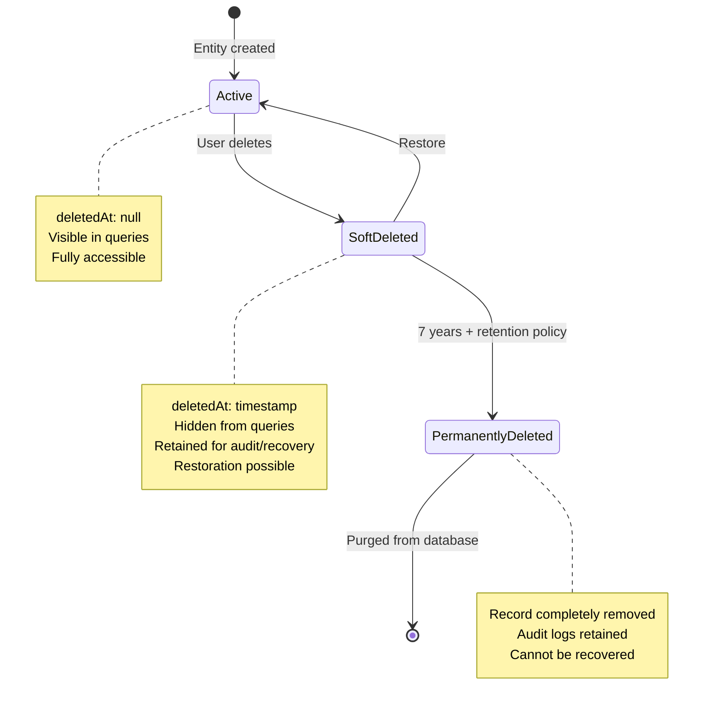

### 7.3 Soft Delete Implementation

**Schema:**
```typescript
interface BaseEntity {
  id: string;
  companyId: string;
  createdAt: number;
  updatedAt: number;
  deletedAt: number | null;  // null = active, timestamp = soft deleted
  versionVector: VersionVector;
}
```

**Soft Delete Function:**
```typescript
export async function deleteAccount(
  id: string,
  companyId: string,
  context?: EncryptionContext
): Promise<DatabaseResult<void>> {
  try {
    // Authorization checks
    const entity = await db.accounts.get(id);
    const authCheck = requireCompanyOwnership(entity, companyId);
    if (!authCheck.authorized) {
      return { success: false, error: authCheck.error };
    }

    // Soft delete: Set deletedAt timestamp
    const deleted = {
      ...authCheck.resource,
      deletedAt: Date.now(),
      updatedAt: Date.now(),
      versionVector: incrementVersionVector(
        authCheck.resource.versionVector,
        await getDeviceId()
      ),
    };

    // Save to database (record still exists)
    await db.accounts.put(deleted);

    // Log audit trail
    await logDelete('ACCOUNT', id, authCheck.resource, db);

    return { success: true };
  } catch (error) {
    logger.error('Failed to delete account', { id, error });
    return {
      success: false,
      error: { code: 'DATABASE_ERROR', message: 'Failed to delete account' }
    };
  }
}
```

**Query Filtering:**
```typescript
// All queries MUST filter out soft-deleted entities
export async function getAccounts(
  companyId: string,
  filter?: AccountFilter,
  context?: EncryptionContext
): Promise<DatabaseResult<Account[]>> {
  let query = db.accounts
    .where('companyId')
    .equals(companyId)
    .and((acc) => !acc.deletedAt);  // ✅ Exclude soft deleted

  // Additional filters...
  const entities = await query.toArray();
  return { success: true, data: entities };
}
```

**Restoration:**
```typescript
export async function restoreAccount(
  id: string,
  companyId: string
): Promise<DatabaseResult<Account>> {
  try {
    const entity = await db.accounts.get(id);
    const authCheck = requireCompanyOwnership(entity, companyId);
    if (!authCheck.authorized) {
      return { success: false, error: authCheck.error };
    }

    // Cannot restore if not deleted
    if (!authCheck.resource.deletedAt) {
      return {
        success: false,
        error: { code: 'INVALID_STATE', message: 'Account is not deleted' }
      };
    }

    // Restore: Clear deletedAt
    const restored = {
      ...authCheck.resource,
      deletedAt: null,
      updatedAt: Date.now(),
      versionVector: incrementVersionVector(
        authCheck.resource.versionVector,
        await getDeviceId()
      ),
    };

    await db.accounts.put(restored);
    await logRestore('ACCOUNT', id, restored, db);

    return { success: true, data: fromAccountEntity(restored) };
  } catch (error) {
    logger.error('Failed to restore account', { id, error });
    return {
      success: false,
      error: { code: 'DATABASE_ERROR', message: 'Failed to restore account' }
    };
  }
}
```

### 7.4 Hard Delete (Permanent)

**Use Cases:**
- Retention period expired (7 years for financial data)
- User account deletion (30-day grace period)
- Data export for offboarding (then purge)
- Compliance with "right to be forgotten" (GDPR)

**Implementation:**
```typescript
export async function permanentlyDeleteAccount(
  id: string,
  companyId: string,
  reason: string
): Promise<DatabaseResult<void>> {
  try {
    // Authorization + audit context
    const entity = await db.accounts.get(id);
    const authCheck = requireCompanyOwnership(entity, companyId);
    if (!authCheck.authorized) {
      return { success: false, error: authCheck.error };
    }

    // Must be soft deleted first
    if (!authCheck.resource.deletedAt) {
      return {
        success: false,
        error: {
          code: 'INVALID_STATE',
          message: 'Account must be soft deleted before permanent deletion'
        }
      };
    }

    // Check retention period (7 years for financial data)
    const retentionPeriod = 7 * 365 * 24 * 60 * 60 * 1000;  // 7 years
    const deletedAge = Date.now() - authCheck.resource.deletedAt;
    if (deletedAge < retentionPeriod) {
      return {
        success: false,
        error: {
          code: 'RETENTION_POLICY_VIOLATION',
          message: `Account must be retained for ${Math.ceil((retentionPeriod - deletedAge) / (24 * 60 * 60 * 1000))} more days`
        }
      };
    }

    // Log final audit entry BEFORE deletion
    await logAudit(
      'ACCOUNT',
      id,
      'PERMANENT_DELETE' as AuditAction,
      authCheck.resource,
      { reason },
      db
    );

    // Hard delete from database
    await db.accounts.delete(id);

    logger.info('Account permanently deleted', { id, reason });
    return { success: true };
  } catch (error) {
    logger.error('Failed to permanently delete account', { id, error });
    return {
      success: false,
      error: { code: 'DATABASE_ERROR', message: 'Failed to delete account' }
    };
  }
}
```

**Cascade Deletion:**
When a parent entity is deleted, related entities must be handled:
- Transactions referencing deleted account: KEEP (audit trail)
- Sub-accounts of deleted parent: CASCADE soft delete
- Invoices referencing deleted contact: KEEP (audit trail)

**Rationale:** Financial data immutability for compliance.

---

## 8. Security Headers and Defense in Depth

### 8.1 HTTP Security Headers

**Configuration File:** `public/_headers`

**Headers Implemented:**

```
# All routes
/*
  Content-Security-Policy: default-src 'self'; script-src 'self'; style-src 'self' 'unsafe-inline'; img-src 'self' data: https:; font-src 'self' data:; connect-src 'self'; frame-ancestors 'none'; base-uri 'self'; form-action 'self'; object-src 'none'
  X-Frame-Options: DENY
  X-Content-Type-Options: nosniff
  X-XSS-Protection: 1; mode=block
  Strict-Transport-Security: max-age=31536000; includeSubDomains; preload
  Referrer-Policy: strict-origin-when-cross-origin
  Permissions-Policy: geolocation=(), microphone=(), camera=()
```

### 8.2 Content Security Policy (CSP)

**Purpose:** Prevents XSS and data injection attacks by controlling resource loading.

**Policy Breakdown:**

| Directive | Value | Purpose |
|-----------|-------|---------|
| `default-src` | `'self'` | Only load resources from same origin |
| `script-src` | `'self'` | Only execute scripts from same origin (no inline, no eval) |
| `style-src` | `'self' 'unsafe-inline'` | Allow same-origin and inline styles (CSS Modules) |
| `img-src` | `'self' data: https:` | Allow same-origin images, data URIs, HTTPS images |
| `font-src` | `'self' data:` | Allow same-origin fonts and data URI fonts |
| `connect-src` | `'self'` | Only network requests to same origin |
| `frame-ancestors` | `'none'` | Cannot be embedded in frames (clickjacking prevention) |
| `base-uri` | `'self'` | Restrict `<base>` tag to same origin |
| `form-action` | `'self'` | Forms can only submit to same origin |
| `object-src` | `'none'` | Disable plugins (Flash, Java, etc.) |

**Why `'unsafe-inline'` in style-src:**
- Required for React CSS Modules and inline styles
- Acceptable risk: CSS injection cannot execute JavaScript
- Alternative would require moving all styles to external files (poor DX)

**Trade-offs:**
- Strict policy prevents some third-party integrations
- Requires careful configuration for CDN resources
- May break some browser extensions (acceptable for security)

### 8.3 Defense in Depth Layers

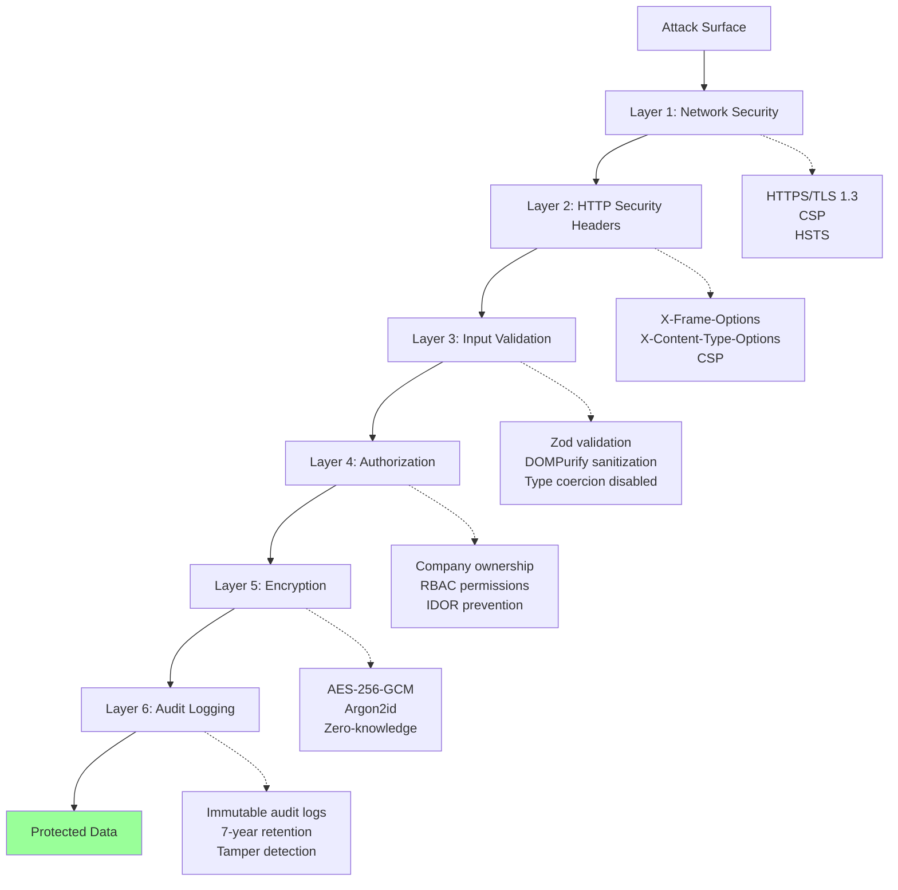

**Why Multiple Layers:**
- Single layer failure doesn't compromise security
- Attacker must bypass ALL layers
- Different layers protect against different attacks
- Redundancy for critical controls

**Example: XSS Protection Layers**
1. **CSP:** Blocks inline scripts and unsafe-eval
2. **Input Validation:** Zod schemas reject malicious inputs
3. **Output Encoding:** React JSX auto-escapes by default
4. **Sanitization:** DOMPurify for user HTML content
5. **Headers:** X-XSS-Protection for legacy browsers

Even if one layer fails (e.g., CSP bypass), others still protect.

### 8.4 Rate Limiting

**Purpose:** Prevent brute force attacks, DoS, and resource exhaustion.

**Implementation Locations:**
1. Login attempts (5 failures per 15 minutes)
2. Key derivation (throttled by Argon2id parameters)
3. API calls (future: when sync relay implemented)

**Login Rate Limiting:**
```typescript
// From authentication module
const MAX_LOGIN_ATTEMPTS = 5;
const LOCKOUT_DURATION_MS = 15 * 60 * 1000;  // 15 minutes

interface LoginAttemptTracker {
  attempts: number;
  lastAttempt: number;
  lockedUntil: number | null;
}

const loginAttempts = new Map<string, LoginAttemptTracker>();

export function checkRateLimit(email: string): boolean {
  const tracker = loginAttempts.get(email);
  const now = Date.now();

  if (!tracker) {
    loginAttempts.set(email, {
      attempts: 1,
      lastAttempt: now,
      lockedUntil: null,
    });
    return true;  // First attempt, allow
  }

  // Check if locked out
  if (tracker.lockedUntil && now < tracker.lockedUntil) {
    const remainingMs = tracker.lockedUntil - now;
    throw new Error(
      `Too many login attempts. Please try again in ${Math.ceil(remainingMs / 60000)} minutes.`
    );
  }

  // Reset if lockout expired
  if (tracker.lockedUntil && now >= tracker.lockedUntil) {
    tracker.attempts = 1;
    tracker.lastAttempt = now;
    tracker.lockedUntil = null;
    return true;
  }

  // Increment attempts
  tracker.attempts++;
  tracker.lastAttempt = now;

  // Lock out if exceeded
  if (tracker.attempts >= MAX_LOGIN_ATTEMPTS) {
    tracker.lockedUntil = now + LOCKOUT_DURATION_MS;
    throw new Error(
      `Too many login attempts. Account locked for ${LOCKOUT_DURATION_MS / 60000} minutes.`
    );
  }

  return true;
}

export function resetRateLimit(email: string): void {
  loginAttempts.delete(email);
}
```

---

## 9. Security Testing Strategy

### 9.1 Test Coverage

**Total Security Tests:** 333 tests (323 passing, 10 skipped)

**Test Suites:**
1. **IDOR Prevention:** 48 tests
2. **Authorization:** 35 tests
3. **Integration:** 19 tests
4. **XSS Prevention:** 70 tests
5. **RBAC Permissions:** 68 tests
6. **Session Security:** 45 tests
7. **Input Validation:** 48 tests

### 9.2 Security Test Categories

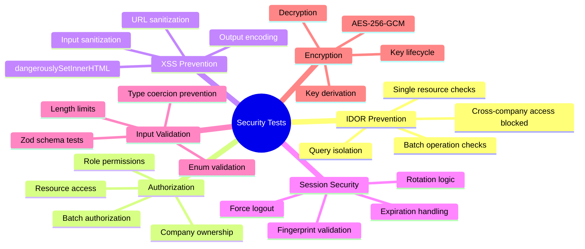

### 9.3 IDOR Test Example

```typescript
describe('IDOR Prevention - Transactions', () => {
  it('should prevent cross-company transaction access', async () => {
    const company1 = await createTestCompany();
    const company2 = await createTestCompany();

    const transaction = await createTransaction({
      companyId: company1.id,
      type: 'JOURNAL_ENTRY',
      description: 'Company 1 Transaction',
    });

    // Attack: Try to access company1's transaction using company2's ID
    const result = await getTransaction(transaction.id, company2.id);

    // Assert: Should return NOT_FOUND (not FORBIDDEN)
    expect(result.success).toBe(false);
    expect(result.error?.code).toBe('NOT_FOUND');
  });

  it('should prevent cross-company batch access', async () => {
    const company1 = await createTestCompany();
    const company2 = await createTestCompany();

    await createTransaction({ companyId: company1.id, description: 'Txn 1' });
    await createTransaction({ companyId: company1.id, description: 'Txn 2' });

    // Try to list company1's transactions using company2's ID
    const result = await getTransactions(company2.id);

    // Should return empty list (not company1's transactions)
    expect(result.success).toBe(true);
    expect(result.data).toHaveLength(0);
  });
});
```

### 9.4 XSS Test Example

```typescript
describe('XSS Prevention - Sanitization', () => {
  it('should sanitize script tags', () => {
    const dirty = '<script>alert("xss")</script><p>Safe content</p>';
    const clean = sanitizeHtml(dirty);

    expect(clean).not.toContain('<script>');
    expect(clean).not.toContain('alert');
    expect(clean).toContain('<p>Safe content</p>');
  });

  it('should sanitize event handlers', () => {
    const dirty = '';
    const clean = sanitizeHtml(dirty);

    expect(clean).not.toContain('onerror');
    expect(clean).not.toContain('alert');
  });

  it('should sanitize dangerous URLs', () => {
    const dangerous = 'javascript:alert(1)';
    const safe = sanitizeUrl(dangerous);

    expect(safe).toBe('about:blank');
  });
});
```

### 9.5 Automated Security Scanning

**Tools:**
- `npm audit` - Dependency vulnerabilities (0 vulnerabilities)
- ESLint security rules - Code patterns
- TypeScript - Type safety
- Vitest - Unit and integration tests

**CI/CD Pipeline:**
```yaml
# Runs on every commit
- npm audit
- npm run test:security
- npm run lint
- npm run type-check
```

---

## 10. Incident Response

### 10.1 Security Incident Classification

**Severity Levels:**

| Severity | Description | Examples | Response Time |
|----------|-------------|----------|---------------|
| CRITICAL | Data breach, system compromise | Unauthorized data access, XSS exploit, IDOR bypass | Immediate (< 1 hour) |
| HIGH | Security vulnerability discovered | Unpatched dependency, authentication bypass | 24 hours |
| MEDIUM | Suspicious activity, policy violation | Multiple failed logins, unusual data export | 48 hours |
| LOW | Security monitoring alert | Rate limit triggered, minor config issue | 1 week |

### 10.2 Incident Response Workflow

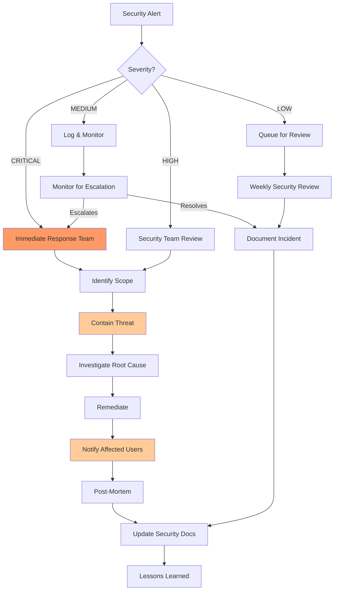

### 10.3 Incident Response Procedures

**Step 1: Detection**
- Security event listener triggers alert
- Audit log analysis identifies pattern
- User reports suspicious activity
- Monitoring system detects anomaly

**Step 2: Assessment**
- Determine severity level
- Identify affected users/companies
- Assess data exposure risk
- Document initial findings

**Step 3: Containment**
- Force logout affected sessions
- Revoke compromised credentials
- Block malicious IP addresses (if applicable)
- Disable compromised accounts

**Step 4: Investigation**
- Review audit logs
- Analyze attack vectors
- Identify root cause
- Preserve evidence

**Step 5: Remediation**
- Patch vulnerability
- Update security controls
- Strengthen affected areas
- Deploy fixes

**Step 6: Notification**
- Notify affected users (if data breach)
- Report to authorities (if required by law)
- Internal stakeholder communication
- Public disclosure (if warranted)

**Step 7: Post-Mortem**
- Document incident timeline
- Identify lessons learned
- Update security procedures
- Implement preventive measures

### 10.4 Security Contact

**For Security Issues:**
- Email: security@gracefulbooks.com (when available)
- Responsible Disclosure: security-reports@gracefulbooks.com
- PGP Key: Available on website

**What to Report:**
- Security vulnerabilities
- Data breaches
- Suspicious activity
- Authentication issues

**Response SLA:**
- CRITICAL: 1 hour acknowledgment, 24 hour resolution
- HIGH: 24 hour acknowledgment, 72 hour resolution
- MEDIUM: 48 hour acknowledgment, 1 week resolution
- LOW: 1 week acknowledgment, 2 week resolution

---

## Appendix A: Security Checklist for Developers

When implementing new features, verify:

**Authorization:**
- [ ] All data access functions require `companyId` parameter
- [ ] `validateCompanyId()` called before database queries
- [ ] `requireCompanyOwnership()` used for single resource checks
- [ ] `requireBatchCompanyOwnership()` used for batch operations
- [ ] Returns `NOT_FOUND` for unauthorized access (not `FORBIDDEN`)

**Input Validation:**
- [ ] Zod schemas defined for all user inputs
- [ ] String length limits to prevent DoS
- [ ] Numeric bounds to prevent overflow
- [ ] Enum validation for fixed value sets
- [ ] XSS detection patterns checked

**Encryption:**
- [ ] Sensitive fields encrypted before storage
- [ ] Master key only in memory (never persisted)
- [ ] Decryption only after authorization passes
- [ ] Encryption context provided where needed

**Session Management:**
- [ ] Session activity updated on user interaction
- [ ] Session validation before protected operations
- [ ] Force logout on security events
- [ ] Session events logged for audit

**Audit Logging:**
- [ ] Audit context set at login
- [ ] Changes logged with before/after values
- [ ] Entity type and action specified
- [ ] Audit logs never updated or deleted

**Testing:**
- [ ] IDOR tests for cross-company access
- [ ] Authorization tests for permission checks
- [ ] XSS tests for user inputs
- [ ] Integration tests for complete flows

---

## Appendix B: Security Architecture Decisions

### Why Zero-Knowledge?
- **User sovereignty:** Users own their data, not the platform
- **Privacy:** Platform operator cannot access financial data
- **Compliance:** Reduces liability for data breaches
- **Trust:** Verifiable security claims

**Trade-off:** Cannot provide cloud-based analytics or search without client-side decryption.

### Why Company-Scoped Authorization?
- **Multi-tenancy:** Each company's data isolated
- **Simplicity:** Single authorization check pattern
- **Performance:** Database indexes on `companyId`
- **Auditability:** Clear ownership boundaries

**Trade-off:** Cannot implement cross-company features (by design).

### Why Client-Side Sessions?
- **Local-first:** Works offline without server
- **Zero-knowledge:** No server-side state
- **Simplicity:** No distributed session management
- **Control:** User controls session lifecycle

**Trade-off:** Cannot implement server-side session revocation (requires sync).

### Why Soft Deletes?
- **Compliance:** 7-year retention for financial data
- **Recovery:** Users can restore accidentally deleted items
- **Audit trail:** Complete history of changes
- **CRDT sync:** Tombstone pattern for distributed sync

**Trade-off:** Deleted records consume storage until retention period expires.

### Why NOT Server-Side Rendering?
- **Zero-knowledge:** Server cannot decrypt data to render
- **Security:** No server-side XSS vulnerabilities
- **Simplicity:** Single deployment target (client)
- **Performance:** Client-side caching, no round trips

**Trade-off:** Slower initial page load, no SEO benefits (acceptable for SaaS app).

---

## Appendix C: Security References

**Standards:**
- OWASP Top 10 (2021): https://owasp.org/Top10/
- NIST Cybersecurity Framework: https://www.nist.gov/cyberframework
- CWE Top 25: https://cwe.mitre.org/top25/
- GAAP Financial Reporting: https://www.fasb.org/

**Cryptography:**
- AES-GCM: NIST SP 800-38D
- Argon2: https://github.com/P-H-C/phc-winner-argon2
- Web Crypto API: https://www.w3.org/TR/WebCryptoAPI/

**Testing:**
- IDOR Testing: OWASP Testing Guide v4
- XSS Testing: OWASP XSS Prevention Cheat Sheet
- Session Management: OWASP Session Management Cheat Sheet

**Compliance:**
- SOC 2: https://www.aicpa.org/interestareas/frc/assuranceadvisoryservices/socforserviceorganizations
- GDPR: https://gdpr.eu/
- CCPA: https://oag.ca.gov/privacy/ccpa

---

## Document Change History

| Version | Date | Author | Changes |
|---------|------|--------|---------|
| 1.0 | 2026-02-23 | Security Team | Initial comprehensive security architecture documentation |

---

**Document Classification:** Internal - For Security Review
**Next Review Date:** 2026-08-23 (6 months)
**Maintained By:** Security Team
**Contact:** security@gracefulbooks.com
